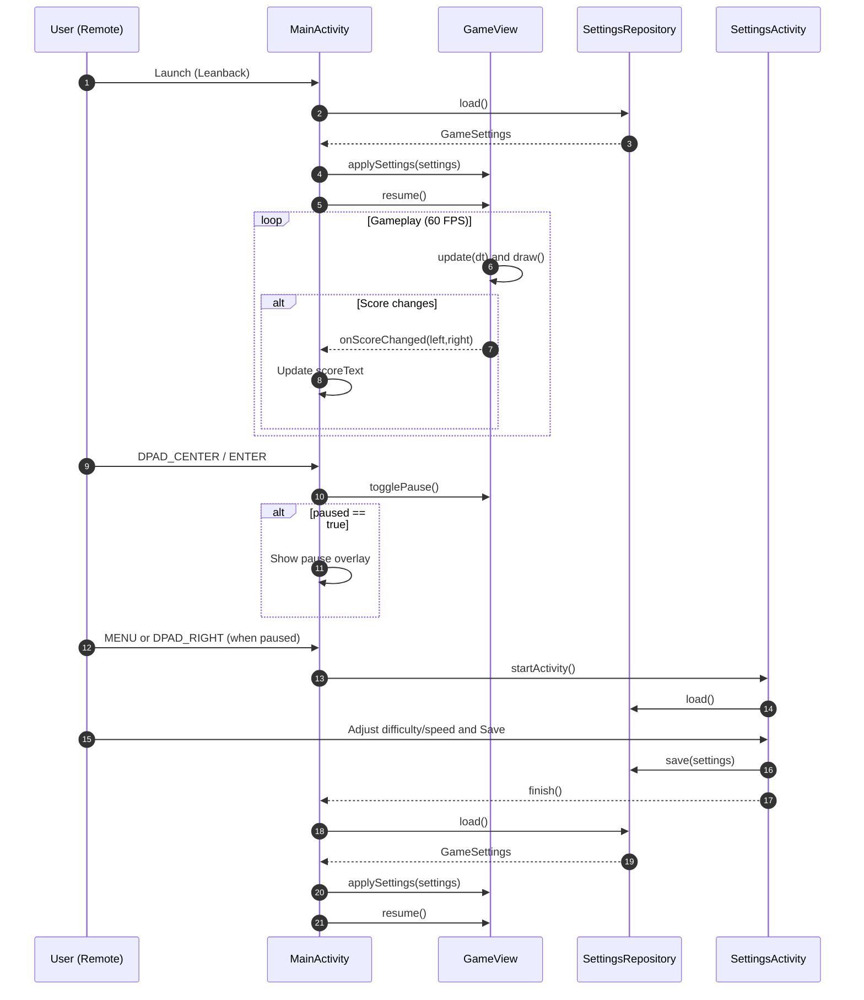

# Architecture

## Overview
The Ping Pong Android TV application is structured as a single-module Android project focused on a lean, responsive TV experience. The architecture emphasizes clear separation of concerns between activity-level orchestration, a custom rendering/game loop view, and a small settings persistence layer. The design is intentionally simple to keep frame times consistent and avoid UI thread jank on TV hardware.

## Modules and Responsibilities
### Application Module: ping_pong_frontend
- Entry point and navigation:
  - MainActivity is the Leanback launcher activity. It initializes ViewBinding, hosts the GameView, presents top score and bottom hints, and shows a pause overlay. It routes DPAD/menu actions to the correct destinations (pause toggle, settings screen).
- Game loop and rendering:
  - GameView is a custom View responsible for update/render cycles at ~60 FPS using a coroutine on the main dispatcher. It manages ball physics, paddle motion, collision detection, score, and basic AI.
- Settings:
  - SettingsActivity presents a TV-friendly card layout with two Spinners (Difficulty and Speed) and Save/Cancel actions.
  - SettingsRepository uses SharedPreferences for persistence and returns a GameSettings data class to the caller.

## Data Flow and Interactions
- Input handling:
  - MainActivity captures KeyEvents (DPAD_UP/DOWN, DPAD_CENTER/ENTER, MENU, BACK). It delegates paddle movement and pause toggling to GameView.
- Game updates:
  - GameView maintains state (positions, velocities, scores) and calls onScoreChanged and onPausedChanged callbacks to update MainActivity’s overlay and score text.
- Settings application:
  - On resume, MainActivity reads persisted settings via SettingsRepository and applies them to GameView. GameView translates Difficulty into AI lag and paddle size, and Speed into base velocities.

## Key Classes and Data Structures
- GameSettings: Data class with difficulty and speed fields.
- Difficulty: EASY, MEDIUM, HARD enums that adjust AI tracking lag and paddle height.
- Speed: SLOW, NORMAL, FAST enums controlling ball and paddle base speeds.
- GameView properties: ball position/velocity, paddle positions, paddle dimensions, scores, paints, and coroutines Job handle.

## UI Composition
- activity_main.xml:
  - Score surface (rounded card with shadows) across the top.
  - Center game area filled by GameView with a “table” background layer-list (border and center line).
  - Bottom hints surface for control guidance.
  - Pause overlay (dim background) with a centered surface card containing two buttons.
- activity_settings.xml:
  - Centered card with title, labels/spinners for Difficulty and Speed, and action buttons.

## External Libraries and Platform Components
- AndroidX Leanback theme: Ensures TV-appropriate base theme and widgets.
- ConstraintLayout: For flexible large-screen composition.
- Lifecycle and Fragment KTX: Activity conveniences.
- Kotlin coroutines: Main thread loop timing and scheduling.
- Retrofit/Gson/OkHttp, Media3, Glide: Included for future expansion (network, media, images). Not actively used in current gameplay.

## Sequence Diagram

## Error Handling and Performance Considerations
- Game loop rate limiting: dt clamped to 0.033s to stabilize integration at ~60 FPS.
- Bounds clamping for paddles to avoid drawing outside the view.
- Coroutine job lifecycle management: Canceled on onDetachedFromWindow and restarted on attach/resume.

## Testing Strategy
- Unit tests can validate simple logic (e.g., settings persistence and mapping), while gameplay visuals are best verified on-device/emulator.
- For future work, extract collision and physics helpers into testable functions to increase coverage.

## File Index (References)
- AndroidManifest.xml
- MainActivity.kt
- GameView.kt
- SettingsActivity.kt
- SettingsRepository.kt
- activity_main.xml
- activity_settings.xml
- colors.xml
- styles.xml
- app/build.gradle.kts

Sources:
- ping_pong_frontend/app/src/main/AndroidManifest.xml
- ping_pong_frontend/app/src/main/java/com/example/ping_pong_frontend/MainActivity.kt
- ping_pong_frontend/app/src/main/java/com/example/ping_pong_frontend/GameView.kt
- ping_pong_frontend/app/src/main/java/com/example/ping_pong_frontend/SettingsActivity.kt
- ping_pong_frontend/app/src/main/java/com/example/ping_pong_frontend/SettingsRepository.kt
- ping_pong_frontend/app/src/main/res/layout/activity_main.xml
- ping_pong_frontend/app/src/main/res/layout/activity_settings.xml
- ping_pong_frontend/app/src/main/res/values/colors.xml
- ping_pong_frontend/app/src/main/res/values/styles.xml
- ping_pong_frontend/app/build.gradle.kts
